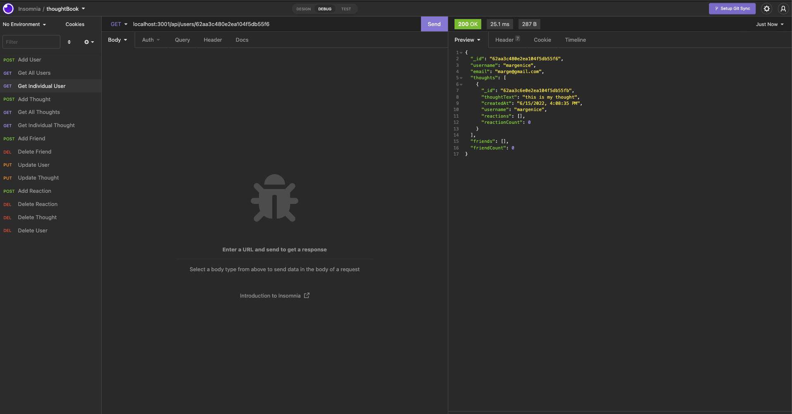

# thoughtBook

thoughtBook is a social media backend that creates users and allows them to create thoughts and reactions.

## Screenshots

Viewing a single user in insomnia:

## Installation and Start Up

1. To install, `git clone` the repository and run `npm install` to install dependencies.

2. You must have MongoDB installed on your computer to run this application.  

3. `npm start` will open a database connection and start the server, which can then be accessed in Insomnia or Postman at the appropriate host.

## Video walkthrough

[Here is a video demonstrating the routes]()

## Technologies

This app uses:

- Express
- Node
- MongoDB
- Mongoose ODM
